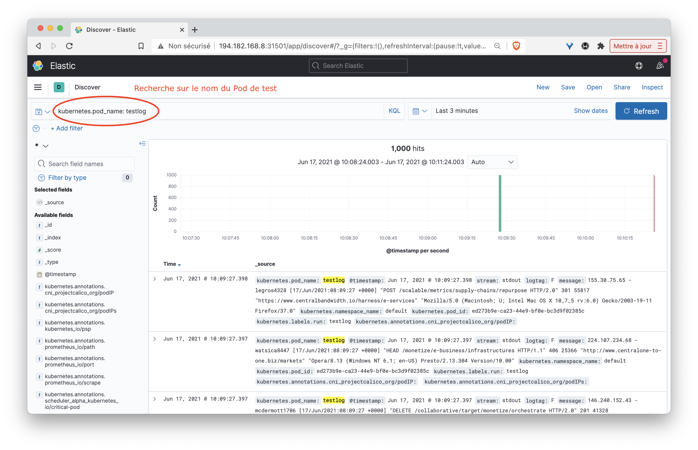

# Déploiement d'un DaemonSet fluent-bit

## 1. But de cet exercice

Vous allez maintenant déployer des agents *fluent-bit* sur l'ensemble des machines du cluster. Ces agents seront configurés afin de lire les logs présents en local et les envoyer dans une stack Elastic.

Note: assurez-vous qu'une stack Elastic tourne dans le namespace *default*. Si ce n'est pas le cas vous pouvez la relancer facilement avec la commande suivante:

```
$ kubectl apply -f https://luc.run/elastic.yaml
```

Note: dans cet exemple le composant Logstash de la stack Elastic sera déployé mais il ne sera pas utilisé

## 2. Définition des droits d'accès

Les Pods *fluent-bit* qui seront déployés auront besoin de droit d'accès pour communiquer avec l'API serveur.
A l'aide des commandes suivantes, vous allez créer les ressources nécessaires pour la spécification de ces  droits: 

- un Namespace *logging*
- un ServiceAccount
- un Role définissant les règles pour la lecture des Pods et des Namespaces du cluster
- un RoleBinding associant le Role et le ServiceAccount

1er cas: si vous utilisez une version de Kubernetes < 1.22:

```
kubectl create namespace logging
kubectl create -f https://raw.githubusercontent.com/fluent/fluent-bit-kubernetes-logging/master/fluent-bit-service-account.yaml
kubectl create -f https://raw.githubusercontent.com/fluent/fluent-bit-kubernetes-logging/master/fluent-bit-role.yaml
kubectl create -f https://raw.githubusercontent.com/fluent/fluent-bit-kubernetes-logging/master/fluent-bit-role-binding.yaml
```

2ème cas: si vous utilisez une version de Kubernetes >= 1.22:

```
kubectl create namespace logging
kubectl create -f https://raw.githubusercontent.com/fluent/fluent-bit-kubernetes-logging/master/fluent-bit-service-account.yaml
kubectl create -f https://raw.githubusercontent.com/fluent/fluent-bit-kubernetes-logging/master/fluent-bit-role-1.22.yaml
kubectl create -f https://raw.githubusercontent.com/fluent/fluent-bit-kubernetes-logging/master/fluent-bit-role-binding-1.22.yaml
```

## 3. Configuration des Pods fluent-bit

Afin de configurer les Pods fluent-bit, il est nécessaire de créer une ConfigMap contenant différents fichiers de configuration.

Utilisez la commande suivante afin de récupérer la spécification de cette ConfigMap.

````
$ curl -o fluent-bit-configmap.yaml https://raw.githubusercontent.com/fluent/fluent-bit-kubernetes-logging/master/output/elasticsearch/fluent-bit-configmap.yaml
````

:fire: Si votre cluster n'utilise PAS Docker comme runtime de container, modifiez le contenu présent sous la clé *input-kubernetes.conf* en remplaçant *docker* par *cri*

````
input-kubernetes.conf: |
    [INPUT]
        Name              tail
        Tag               kube.*
        Path              /var/log/containers/*.log
        Parser            cri        # <- remplacement du parser "docker" par "cri"
        DB                /var/log/flb_kube.db
        Mem_Buf_Limit     5MB
        Skip_Long_Lines   On
        Refresh_Interval  10
````

Créez la ConfigMap avec la commande suivante:

````
$ kubectl apply -f fluent-bit-configmap.yaml
````

## 4. DaemonSet Fluent-bit

Utilisez la commande suivante afin de récupérer la spécification du DaemonSet qui sera utilisé pour lancer les Pods fluent-bit.

````
$ curl -o fluent-bit-ds.yaml https://raw.githubusercontent.com/fluent/fluent-bit-kubernetes-logging/master/output/elasticsearch/fluent-bit-ds.yaml
````

:fire: La stack Elastic tourne dans le namespace *default*, cependant les Pods *fluent-bit* seront lancés dans le namespace *logging*. Il est nécessaire de modifier la valeur de la variable d'environnement *FLUENT_ELASTICSEARCH_HOST* des Pods *fluent-bit* de façon à ce que celle-ci référence le service *elasticsearch* présent dans le namespace *default*:

````
env:
        - name: FLUENT_ELASTICSEARCH_HOST
          value: "elasticsearch.default"     # <- ajout du namespace "default" 
        - name: FLUENT_ELASTICSEARCH_PORT
          value: "9200"
````

Lancez ensuite le DaemonSet avec la commande suivante:

````
$ kubectl apply -f fluent-bit-ds.yaml
````

Nous pouvons alors vérifier qu'un Pod a été lancé sur chaque node du cluster.

```
$ kubectl get po -n logging
NAME               READY   STATUS    RESTARTS   AGE
fluent-bit-4dj5f   1/1     Running   0          7s
fluent-bit-lvjh5   1/1     Running   0          7s
fluent-bit-zgmtv   1/1     Running   0          7s
```

## 5. Visualisation des logs

Lancer le Pod suivant afin de générer des logs fictifs:

```
$ kubectl run testlog --restart=Never --image=mingrammer/flog -- -f apache_combined
```

Assurez-vous ensuite que ces logs apparaissent bien dans Kibana:



Utilisez pour cela le filtre suivant:

```
kubernetes.pod_name:testlog
```

Vous pouvez filtrer davantage en recherchant par exemple un mot clé dans le message:

```
kubernetes.pod_name:testlog AND message:POST
```

## 5. Cleanup

Vous pouvez maintenant supprimer les différentes ressources créées précédemment:

```
kubectl delete -f https://luc.run/elastic.yaml
kubectl delete pod testlog
kubectl delete ns logging
```
