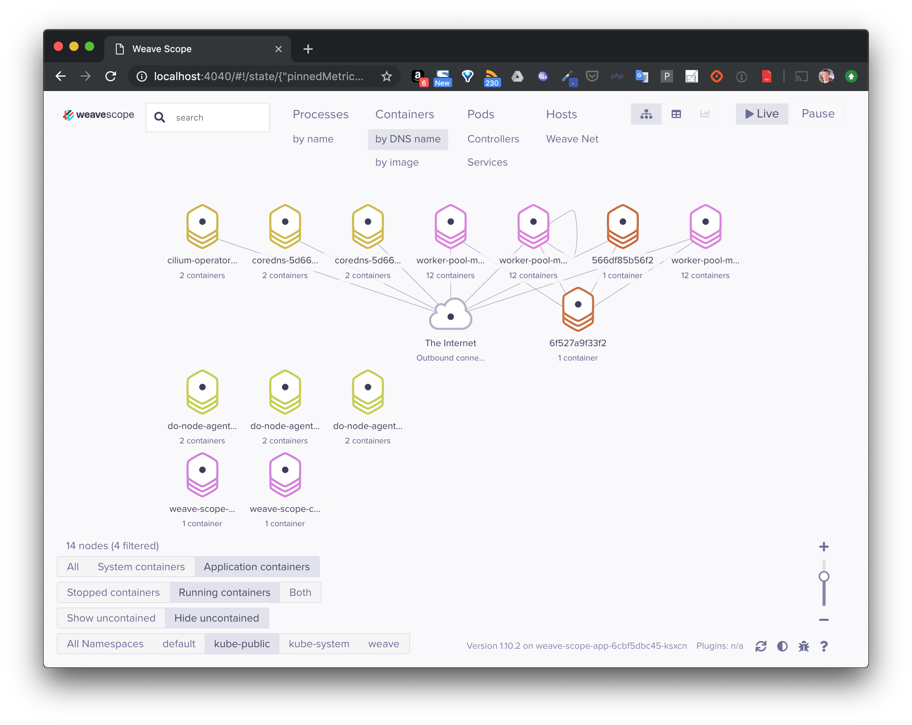

# Déploiement de la solution Weave Scope

## 1. But de cet exercice

Vous allez déployer Weave Scope, une application qui permet d'observer les processus, containers, ainsi que différents éléments de l'infrastructure. Cette solution sera déployée en tant que *DaemonSet*.

## 2. Création des ressources

Utilisez la commande suivante pour installer l'application:

```
$ kubectl apply -f "https://cloud.weave.works/k8s/scope.yaml?k8s-version=$(kubectl version | base64 | tr -d '\n')"
```

Examinez l'ensemble des ressources définies dans le fichier *scope.yaml*, lesquelles reconnaissez-vous ?

Note: vous pouvez récupérer ce fichier avec la commande suivante:

```
$ curl -sSL -o scope.yaml "https://cloud.weave.works/k8s/scope.yaml?k8s-version=$(kubectl version | base64 | tr -d '\n')"
```

## 3. Liste des ressources

L'application étant déployée dans le namespace *weave*, utilisez la commande suivante pour lister les différentes ressources qui ont été créées dans ce namespace:

```
$ kubectl get all -n weave
```

## 4. Accès à l'interface web

Pour accèder à l'interface, nous allons faire un *port-forward* sur le Pod applicatif.

Récupérez l'identifiant de ce Pod avec la commande suivante:

```
$ POD=$(kubectl get -n weave pod --selector=weave-scope-component=app -o jsonpath='{.items..metadata.name}')
```

Faites ensuite le forward de port:

```
$ kubectl port-forward -n weave $POD 4040
```

L'interface sera alors disponible sur le port *4040* de la machine cliente.



Naviguez dans cette interface et visualisez les différents éléments.

## 5. Cleanup

Supprimez l'application Weave Scope avec la commande suivante:

```
$ kubectl delete -f "https://cloud.weave.works/k8s/scope.yaml?k8s-version=$(kubectl version | base64 | tr -d '\n')"
```
