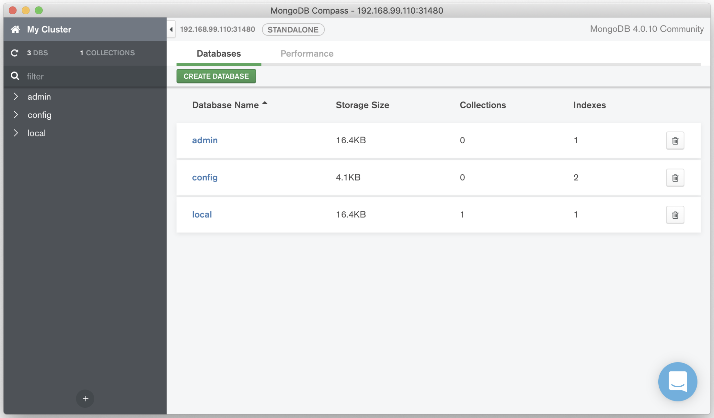

## Objectif

Dans cet exercice nous allons créer un Operator simple avec le framework Kopf de ZalandoTech.

## Kubernetes Operator Pythonic Framework

Le projet Kopf (nom abrégé de ce framework) est disponible sur https://github.com/zalando-incubator/kopf. Il est bien documenté et contient de nombreux exemples https://kopf.readthedocs.io.

## Objectif de notre Operator

L'Operator que nous allons développer définira sa propre ressource que l'on appelera *Database*. Lorsqu'une ressource de ce type sera créée, l'Operator déclenchera automatiquement la création d'un *Pod* et d'un *Service*:
- le *Pod* définissant un container basé sur l'image *mongo* ou *mysql*, en fonction de la valeur du champ *type* définit dans la ressource *Database*
- le *Service* servant à exposer ce *Pod* à l'extérioeur du cluster

Ne vous inquiétez pas si ce n'est pas tout à fait clair, nous allons voir les étapes les unes après les autres.

### CustomResourceDefinition (CRD)

Un Operator définit généralement ses propres ressources Kubernetes sur lesquelles il opère. La définition d'une nouvelle ressource Kubernetes est effectuée à partir d'une *CustomResourceDefinition* (ou *CRD*).

A l'aide de la commande ci-dessous, créez une *CustomResourceDefinition* définissant une ressource nommée *Database*, cette dernière définit un champ *Type* de type *string*.

```
$ kubectl apply -f - <<EOF
apiVersion: apiextensions.k8s.io/v1
kind: CustomResourceDefinition
metadata:
  name: databases.zalando.org
spec:
  group: zalando.org
  scope: Namespaced
  names:
    kind: Database
    plural: databases
    singular: database
    shortNames:
    - db
    - dbs
  versions:
  - name: v1
    served: true
    storage: true
    schema:
      openAPIV3Schema:
        type: object
        properties:
          spec:
            type: object
            properties:
              type:
                type: string
EOF
```

Vous obtiendrez la réponse suivante indiquant que la nouvelle ressource a été correctement créée:

```
customresourcedefinition.apiextensions.k8s.io/databases.zalando.org created
```

Un nouveau type de ressource existe maintenant dans le cluster. Nous allons définir un Operator qui va l'utiliser.

### Code de notre Operator

Afin de déclencher des actions lors de la création ou de la suppression d'une ressource *Database*, nous allons utiliser le script python suivant, que nous sauvegarderons dans le fichier *handlers.py*:

```
import kopf
import kubernetes
import yaml

@kopf.on.create('zalando.org', 'v1', 'databases')
def create_fn(body, spec, **kwargs):
    # Get info from Database object
    name = body['metadata']['name']
    namespace = body['metadata']['namespace']
    type = spec['type']

    # Make sure type is provided
    if not type:
        raise kopf.HandlerFatalError(f"Type must be set. Got {type}.")

    # Pod template
    pod = {'apiVersion': 'v1', 'metadata': {'name' : name, 'labels': {'app': 'db'}}}

    # Service template
    svc = {'apiVersion': 'v1', 'metadata': {'name' : name}, 'spec': { 'selector': {'app': 'db'}, 'type': 'NodePort'}}

    # Update templates based on Database specification

    if type == 'mongo':
      image = 'mongo:4.0'
      port = 27017
      pod['spec'] = { 'containers': [ { 'image': image, 'name': type } ]}
      svc['spec']['ports'] = [{ 'port': port, 'targetPort': port}]
    if type == 'mysql':
      image = 'mysql:8.0'
      port = 3306
      pod['spec'] = { 'containers': [ { 'image': image, 'name': type, 'env': [ { 'name': 'MYSQL_ROOT_PASSWORD', 'value': 'my_passwd' } ] } ]}
      svc['spec']['ports'] = [{ 'port': port, 'targetPort': port}]

    # Make the Pod and Service the children of the Database object
    kopf.adopt(pod, owner=body)
    kopf.adopt(svc, owner=body)

    # Object used to communicate with the API Server
    api = kubernetes.client.CoreV1Api()

    # Create Pod
    obj = api.create_namespaced_pod(namespace, pod)
    print(f"Pod {obj.metadata.name} created")

    # Create Service
    obj = api.create_namespaced_service(namespace, svc)
    print(f"NodePort Service {obj.metadata.name} created, exposing on port {obj.spec.ports[0].node_port}")

    # Update status
    msg = f"Pod and Service created by Database {name}"
    return {'message': msg}

@kopf.on.delete('zalando.org', 'v1', 'databases')
def delete(body, **kwargs):
    msg = f"Database {body['metadata']['name']} and its Pod / Service children deleted"
    return {'message': msg}
```

Ce script n'est pas très compliqué, voyons les parties principales:

- on définit la fonction déclenchée lorsqu'une ressource *Database* est créée:

```
@kopf.on.create('zalando.org', 'v1', 'databases')
def create_fn(body, spec, **kwargs):
```

- on récupère les champs de la ressource *Database* et on s'assure que le *type* est renseigné

```
    # Get info from Database object
    name = body['metadata']['name']
    namespace = body['metadata']['namespace']
    type = spec['type']

    # Make sure type is provided
    if not type:
        raise kopf.HandlerFatalError(f"Type must be set. Got {type}.")
```

- on définit un modèle pour le Pod de base de données et un autre pour le Service qui sera utilisé pour exposer le pod.

```
    # Pod template
    pod = {'apiVersion': 'v1', 'metadata': {'name' : name, 'labels': {'app': 'db'}}}

    # Service template
    svc = {'apiVersion': 'v1', 'metadata': {'name' : name}, 'spec': { 'selector': {'app': 'db'}, 'type': 'NodePort'}}

```

- on ajout des éléments supplémentaires dans le modèle Pod et Service en fonction de la valeur du champ *type*

```
if type == 'mongo':
  image = 'mongo:4.0'
  port = 27017
  pod['spec'] = { 'containers': [ { 'image': image, 'name': type } ]}
  svc['spec']['ports'] = [{ 'port': port, 'targetPort': port}]
if type == 'mysql':
  image = 'mysql:8.0'
  port = 3306
  pod['spec'] = { 'containers': [ { 'image': image, 'name': type, 'env': [ { 'name': 'MYSQL_ROOT_PASSWORD', 'value': 'my_passwd' } ] } ]}
  svc['spec']['ports'] = [{ 'port': port, 'targetPort': port}]
```

- on associe le Pod et le Service à la ressource *Database*. La suppression de cette ressource entrainera automatiquement la suppression du Pod et du Service

```
# Make the Pod and Service the children of the Database object
kopf.adopt(pod, owner=body)
kopf.adopt(svc, owner=body)
```

- on appelle l'API Server et on lui demande de créer le Pod et le Service dont on a définit la spécification précédemment:

```
    # Object used to communicate with the API Server
    api = kubernetes.client.CoreV1Api()

    # Create Pod
    obj = api.create_namespaced_pod(namespace, pod)
    print(f"Pod {obj.metadata.name} created")

    # Create Service
    obj = api.create_namespaced_service(namespace, svc)
    print(f"NodePort Service {obj.metadata.name} created, exposing on port {obj.spec.ports[0].node_port}")
```

- on définit la fonction déclenchée lorsqu'une ressource *Database* est supprimée

```
@kopf.on.delete('zalando.org', 'v1', 'databases')
def delete(body, **kwargs):
```

### Création d'une image Docker

L'Operator est un process qui tournera dans un Pod. Il faut donc que l'on le package dans une image Docker. Nous utiliserons pour cela le *Dockerfile* suivant:

```
FROM python:3.7
COPY handlers.py /handlers.py
RUN pip install kopf kubernetes
CMD kopf run --standalone /handlers.py
```

Nous construisons ensuite l'image avec la commande suivante:

```
$ docker image build -t lucj/op-db:latest .
```

Attention: si vous voulez contruire et utilisez votre propre image Docker dans la suite, il vous faudra replacer l'utilisateur *lucj* avec votre propre utilisateur *DockerHub* dans tout ce qui suit.

Nous envoyons ensuite cette image le *DockerHub*:

```
$ docker image push lucj/op-db:latest
```

### RBAC Rules

L'Operator que nous sommes en train de développer aura besoin des droits lui permettant de créer des ressources de type *Pod* et *Service*. Nous allons commencer par créer un *ServiceAccount* que nous utiliserons pour cet Operator:

```
$ kubectl apply -f - <<EOF
apiVersion: v1
kind: ServiceAccount
metadata:
  name: db-operator
EOF
```

puis nous associons ce *ServiceAccount* au role *cluster-admin*

```
$ kubectl apply -f - <<EOF
apiVersion: rbac.authorization.k8s.io/v1
kind: ClusterRoleBinding
metadata:
  name: db-operator
roleRef:
  apiGroup: rbac.authorization.k8s.io
  kind: ClusterRole
  name: cluster-admin
subjects:
  - kind: ServiceAccount
    name: db-operator
    namespace: default
EOF
```

Attention: le *Role* *cluster-admin* donne, aux Pods qui l'utilisent, tous les droits sur le cluster. Dans un contexte de production, il faudrait définir un *Role* n'authorisant que les actions dont l'Operator a réellement besoin (principe de moindres privilèges).

### Deployment de l'Operator

Nous déployons maintenant l'Operator avec la commande suivante:

```
$ kubectl apply -f - <<EOF
apiVersion: apps/v1
kind: Deployment
metadata:
  name: op
spec:
  selector:
    matchLabels:
      app: op
  template:
    metadata:
      labels:
        app: op
    spec:
      serviceAccountName: db-operator
      containers:
      - image: lucj/db-op:latest
        name: op
EOF
```

puis nous vérifions ensuite que le *Deployment* et le *Pod* associé ont bien été crées:

```
$ kubectl get deploy,pod
NAME                       READY   UP-TO-DATE   AVAILABLE   AGE
deployment.extensions/op   1/1     1            1           5m54s
NAME                      READY   STATUS    RESTARTS   AGE
pod/op-5f578856fd-cmkv2   1/1     Running   0          5m54s
```

### Test

Pour vérifier que notre Operator fonctionne correctement, nous allons créer une ressource *Database* avec la commande suivante:

```
$ kubectl apply -f - <<EOF
apiVersion: zalando.org/v1
kind: Database
metadata:
  name: mongo-db
spec:
  type: mongo
EOF
```

Nous pouvons ensuite vérifier que cela a bien déclenché la création d'un *Pod* et d'un *Service*:

```
$ kubectl get pod,svc
NAME                      READY   STATUS    RESTARTS   AGE
pod/mongo-db              1/1     Running   0          2m39s
pod/op-5f578856fd-cmkv2   1/1     Running   0          9m10s
NAME               TYPE      CLUSTER-IP     EXTERNAL-IP PORT(S)           AGE
service/kubernetes ClusterIP 10.96.0.1      <none>      443/TCP           14m
service/mongo-db   NodePort  10.105.157.68  <none>      27017:31480/TCP   2m39s
```

Comme le champ *type* de la ressource *Database* a comme valeur *mongo*, le *Pod* qui vient d'être créé est basé sur l’image *mongo:4.0* (cela est déterminé par l'Operator). Nous pouvons alors utiliser le NodePort associé au service pour accéder à ce Pod depuis un client MongoDB:




Comme le *Pod* et le *Service* sont définis en tant qu'enfants de la ressource *Database* nous pouvons vérifier qu'ils sont supprimés avec celle-ci.

```
$ kubectl delete database mongo-db
database.zalando.org "mongo-db" deleted
```

```
$ kubectl get pod,svc
NAME                      READY   STATUS    RESTARTS   AGE
pod/op-5f578856fd-cmkv2   1/1     Running   0          11m
NAME                TYPE       CLUSTER-IP  EXTERNAL-IP PORT(S)   AGE
service/kubernetes  ClusterIP  10.96.0.1   <none>      443/TCP   16m
```

Nous pourrions également créer une ressource *Database* dont le champ *type* a pour valeur *mysql*. Notre *Operator* déclencherait automatiquement la création d'un *Pod* dont lequel tourne un container basé sur *mysql:8*, ainsi qu'un *Service*, de type *NodePort* pour l'exposer à l'extérieur du cluster.

## En résumé

Cet exercice présente sur un exemple simple le fonctionnement d'un *Operator* et permet de démistifier un concept relativement avancé. Les choses importantes à retenir:
- un *Operator* utilise généralement des ressources qui sont créées à partir de *CustomResourceDefinition*
- un Operator contient toutes la logique d'administration d'une application
- un Operator est un process qui tourne dans un *Pod*
- un Operator communique avec l'API Server pour manipuler les ressources de base de Kubernetes (Deployment, Pod, Service, DaemonSet, StatefulSet, ...)
