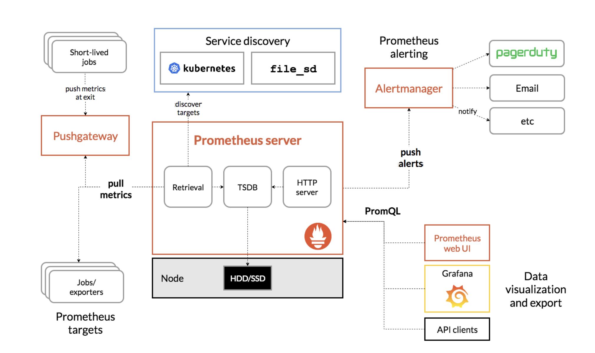
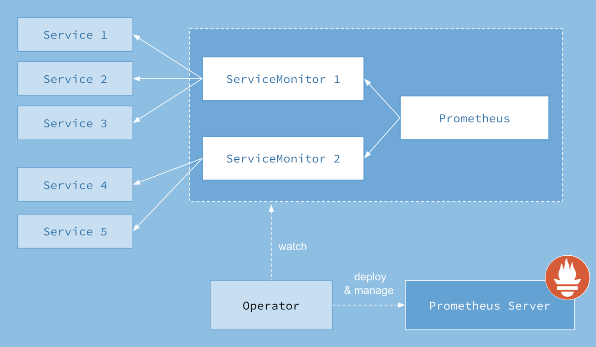
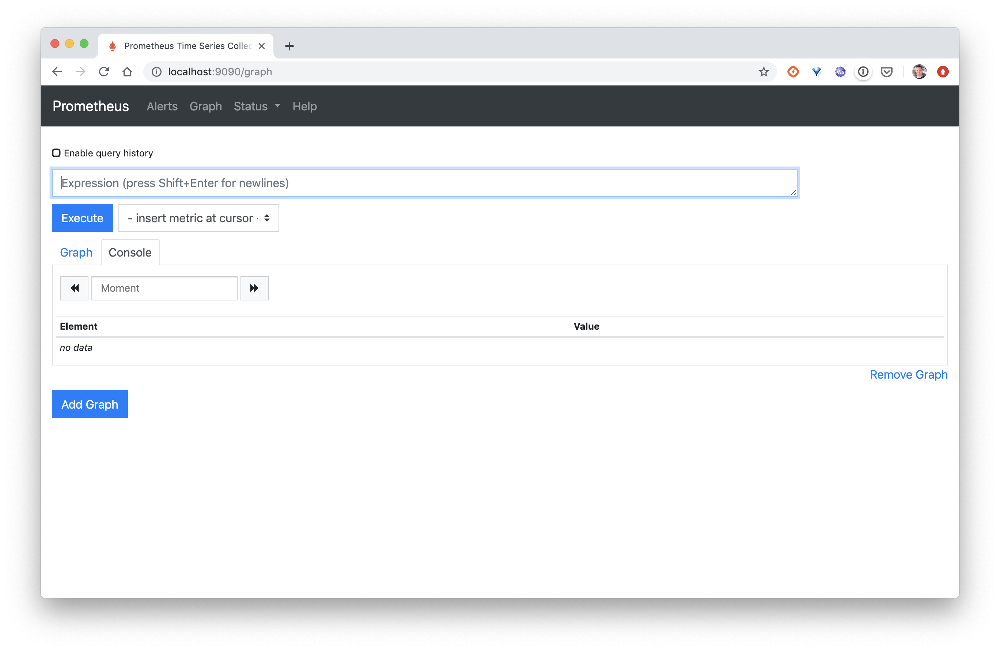

## Objectif

Dans cet exercice nous allons déployer l'Operator Prometheus afin de monitorer le cluster et les applications qui tournent dans celui-ci.

Le schéma suivant expose les intéractions entre les différents composants de la stack Prometheus.



Le schéma suivant met en évident les intéractions entre les différentes ressources Kubernetes qui sont utilisées par l'Operator Prometheus.



## Récupération du projet

```
$ git clone https://github.com/coreos/kube-prometheus.git
$ cd kube-prometheus
```

## Création des ressources

Utilisez la commande suivante pour créer l'ensemble des ressources présentes dans le répertoire *manifests*.

```
$ kubectl create -f manifests/setup
$ until kubectl get servicemonitors --all-namespaces ; do date; sleep 1; echo ""; done
$ kubectl create -f manifests/
```

Différentes ressources sont créées, parmi celles-ci:

- le namespace *monitoring* dans lequel l'ensemble des ressoures suivantes seront déployées
- des CustomResourceDefinitions (ou CRDs) qui permettent de définir des nouvelles resources dans Kubernetes, c'est à dire des ressources qui n'existent pas par défaut. Ces CRDs seront notamment utilisées par l'Operateur Prometheus
- des ressources relatives à la mise en place de l'authentification et de l'autorisation (RBAC) telles que des Roles, RoleBindings, ClusterRole, ClusterRoleBindings ainsi que des ServiceAccounts
- des Deployments et Service pour la mise en place des différents éléments de la stack (l'Operator Prometheus, le server Prometheus, AlertManager, Grafana, ...)
- des ConfigMaps contenant les dashboard prédéfinis de Grafana
- et enfin des ServiceMonitors, ressources utilisées par l'Operator Prometheus pour la configuration du server Prometheus

L'ensemble de ces ressources se trouvent dans le namespace *monitoring*, et peuvent être listées avec la commande suivante:

```
$ kubectl get all -n monitoring
NAME                                      READY   STATUS    RESTARTS   AGE
pod/prometheus-operator-55b978b89-qglhp   1/1     Running   0          2m32s
pod/alertmanager-main-1                   2/2     Running   0          2m24s
pod/alertmanager-main-0                   2/2     Running   0          2m24s
pod/alertmanager-main-2                   2/2     Running   0          2m24s
pod/node-exporter-lmp67                   2/2     Running   0          2m15s
pod/node-exporter-fth9l                   2/2     Running   0          2m15s
pod/node-exporter-w7q4w                   2/2     Running   0          2m15s
pod/prometheus-adapter-668748ddbd-n4kdz   1/1     Running   0          2m12s
pod/kube-state-metrics-ff5cb7949-wkj98    3/3     Running   0          2m16s
pod/grafana-55488b566f-7swtp              1/1     Running   0          2m18s
pod/prometheus-k8s-1                      3/3     Running   1          2m7s
pod/prometheus-k8s-0                      3/3     Running   1          2m7s

NAME                            TYPE        CLUSTER-IP        EXTERNAL-IP   PORT(S)                      AGE
service/prometheus-operator     ClusterIP   None              <none>        8080/TCP                     2m32s
service/alertmanager-main       ClusterIP   192.168.200.224   <none>        9093/TCP                     2m30s
service/alertmanager-operated   ClusterIP   None              <none>        9093/TCP,9094/TCP,9094/UDP   2m24s
service/grafana                 ClusterIP   192.168.133.26    <none>        3000/TCP                     2m19s
service/kube-state-metrics      ClusterIP   None              <none>        8443/TCP,9443/TCP            2m17s
service/node-exporter           ClusterIP   None              <none>        9100/TCP                     2m16s
service/prometheus-adapter      ClusterIP   192.168.245.229   <none>        443/TCP                      2m13s
service/prometheus-operated     ClusterIP   None              <none>        9090/TCP                     2m12s
service/prometheus-k8s          ClusterIP   192.168.192.237   <none>        9090/TCP                     2m10s

NAME                           DESIRED   CURRENT   READY   UP-TO-DATE   AVAILABLE   NODE SELECTOR            AGE
daemonset.apps/node-exporter   3         3         3       3            3           kubernetes.io/os=linux   2m16s

NAME                                  READY   UP-TO-DATE   AVAILABLE   AGE
deployment.apps/prometheus-operator   1/1     1            1           2m32s
deployment.apps/prometheus-adapter    1/1     1            1           2m14s
deployment.apps/kube-state-metrics    1/1     1            1           2m18s
deployment.apps/grafana               1/1     1            1           2m19s

NAME                                            DESIRED   CURRENT   READY   AGE
replicaset.apps/prometheus-operator-55b978b89   1         1         1       2m32s
replicaset.apps/prometheus-adapter-668748ddbd   1         1         1       2m14s
replicaset.apps/kube-state-metrics-ff5cb7949    1         1         1       2m18s
replicaset.apps/grafana-55488b566f              1         1         1       2m19s

NAME                                 READY   AGE
statefulset.apps/alertmanager-main   3/3     2m24s
statefulset.apps/prometheus-k8s      2/2     2m12s
```

Note: la commande précédente a été lancée sur un cluster de 3 nodes contenant 1 master et 2 workers

## Accès à l'interface de Prometheus

Lancez la commande suivante afin d'avoir accès à l'interface web de Prometheus depuis votre machine locale.

```
$ kubectl --namespace monitoring port-forward svc/prometheus-k8s 9090
```

Note: la commande **port-forward** ouvre une connexion entre la machine local et le service spécifié qui tourne sur le cluster

L'interface est alors accessible sur le port 9090



Vous pouvez alors sélectionner une metrics dans la liste déroulante et observer sont évolution dans le temps. La capture d'écran ci-dessous montre l'évolution de la mémoire de chacun des containers (container_memory_usage_bytes)


Prometheus offre le PromQL (Prometheus Query Language), language de query très puissant, permettant de faire des requètes très complexes. Vous trouverez des exemples d'utilisation de PromQL via le lien suivant: [PromQL](https://prometheus.io/docs/prometheus/latest/querying/basics/)

## Accès à l'interface de Grafana

Lancez la commande suivante afin d'avoir accès à l'interface web de Grafana depuis votre machine locale:

```
$ kubectl --namespace monitoring port-forward svc/grafana 3000
```

L'interface est alors accessible sur le port 3000


Les login / mot de passe par défaut sont: admin / admin


Ces interfaces contient différents dashboards permettant de visualiser les ressources du cluster ainsi que des applications tournant sur celui-ci.


Note: la visualisation des metrics d'utilisation de ressources nécessite qu'un serveur de metrics tourne sur le cluster

Note: Vous pouvez utiliser ces dashboards comme base pour créer vos propres dashboards

## Accès à l'interface de Alertmanager

Lancez la commande suivante afin d'avoir accès à l'interface web de Alertmanager depuis votre machine locale:

```
$ kubectl --namespace monitoring port-forward svc/alertmanager-main 9093
```

L'interface est alors accessible sur le port 9093


AlertManager permet de gérer les alertes envoyées par les différents composants, comme le serveur Prometheus. AlertManager s'assure notamment de la déduplication des alertes, de leur regroupement et de l'envoi vers des applications ou outils externe (email, PagerDuty, ...).

## Cleanup

Utilisez la commande suivante pour supprimer l'ensemble des ressources créées précédemment.

```
$ kubectl delete --ignore-not-found=true -f manifests/ -f manifests/setup
```
