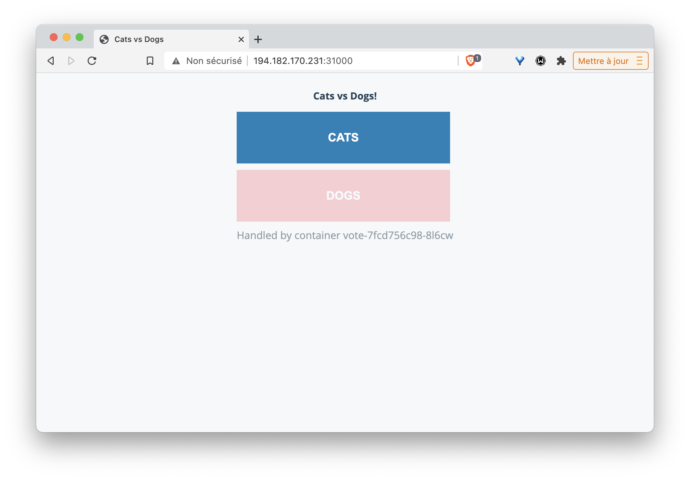
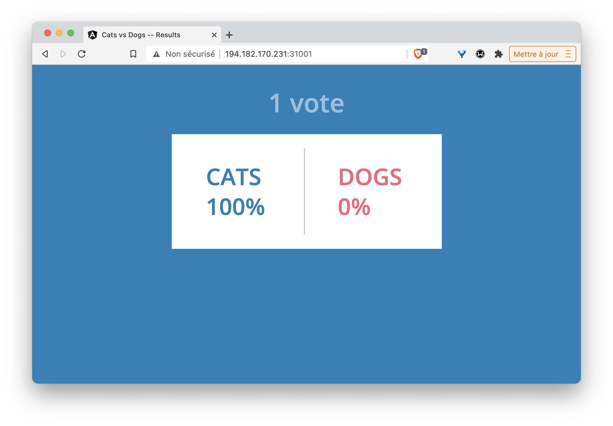
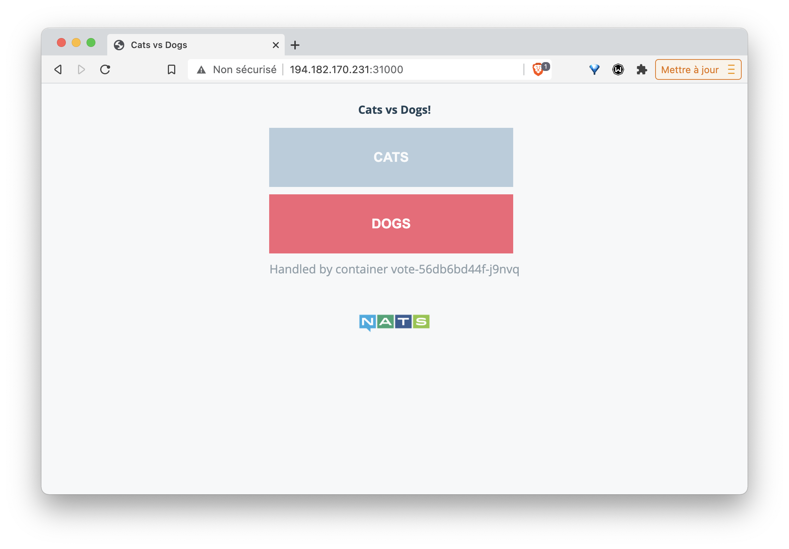

## Deploiement de la VotingApp

Dans cet exercice vous allez déployer la Voting App, une application de vote très souvent utilisée pour les démos et présentation. Cette application suit une architecture microservices, elle est très simple mais permet cependant d'illustrer de nombreux concepts notamment en ce qui concerne l'orchestration.

## Vue d’ensemble

L’application *Voting App* est composée de plusieurs micro-services, ceux utilisés pour la version 2 sont les suivants:


* vote-ui: front-end permettant à un utilisateur de voter entre 2 options
* vote: back-end réceptionnant les votes
* result-ui: front-end permettant de visualiser les résultats
* result: back-end mettant à disposition les résultats
* redis: database redis dans laquelle sont stockés les votes
* worker: service qui récupère les votes depuis redis et consolide les résultats dans une database postgres
* db: database postgres dans laquelle sont stockés les résultats

##  Récupération du répo GitLab

Lancez les commandes suivantes afin de récupérer le répository contenant les fichiers manifests qui décrivent l'application:

```
mkdir VotingApp && cd VotingApp
git clone https://gitlab.com/voting-application/config
cd config
```

## Déploiement de la version 2

Le répertoire *manifests/v2* contient l'ensemble des spécifications des ressources utilisées par la Voting App (dans sa version 2). Pour chaque micro-service de l'application, il y a un Deployment et un Service. Seul le micro-service *worker* n'a pas de Service associé, c'est le seul micro-service qui n'est pas exposé dans le cluster (aucun microservice ne l'appelle).

Lancez la commande suivante afin de créer l'ensemble des ressources de l'application:

```
$ kubectl apply -f ./manifests/v2
deployment.apps/db created
service/db created
deployment.apps/redis created
service/redis created
deployment.apps/result created
service/result created
deployment.apps/result-ui created
service/result-ui created
deployment.apps/vote created
service/vote created
deployment.apps/vote-ui created
service/vote-ui created
deployment.apps/worker created
```

Une fois l'application créée, il est important de vérifier que toutes les ressources ont été créées correctement et que les différents Pods sont dans le status *Running*

```
$ kubectl get deploy,pod,svc
NAME                        READY   UP-TO-DATE   AVAILABLE   AGE
deployment.apps/db          1/1     1            1           63s
deployment.apps/redis       1/1     1            1           63s
deployment.apps/result      1/1     1            1           62s
deployment.apps/result-ui   1/1     1            1           62s
deployment.apps/vote        1/1     1            1           62s
deployment.apps/vote-ui     1/1     1            1           62s
deployment.apps/worker      1/1     1            1           62s

NAME                             READY   STATUS    RESTARTS   AGE
pod/db-5db4758ff-7ggn7           1/1     Running   0          63s
pod/redis-7784f964f6-sjwt7       1/1     Running   0          63s
pod/result-6dcc7677fd-8skhc      1/1     Running   0          62s
pod/result-ui-68d87f557d-5lxjz   1/1     Running   0          62s
pod/vote-7fcd756c98-8l6cw        1/1     Running   0          62s
pod/vote-ui-6cf4d5dbbd-cs844     1/1     Running   0          62s
pod/worker-5c44d48c6c-4ndm9      1/1     Running   0          61s

NAME                 TYPE        CLUSTER-IP       EXTERNAL-IP   PORT(S)          AGE
service/db           ClusterIP   10.106.72.18     <none>        5432/TCP         63s
service/kubernetes   ClusterIP   10.96.0.1        <none>        443/TCP          8m53s
service/redis        ClusterIP   10.97.144.122    <none>        6379/TCP         62s
service/result       NodePort    10.107.31.229    <none>        80:31155/TCP     62s
service/result-ui    NodePort    10.100.128.115   <none>        5001:31001/TCP   62s
service/vote         NodePort    10.105.154.240   <none>        80:31002/TCP     62s
service/vote-ui      NodePort    10.102.31.237    <none>        5000:31000/TCP   62s
```

L'interface de vote est disponible sur le port *31000* de n'importe quelle machine du cluster:

Note: vous pouvez récupérer les IPs externes des machines de votre cluster avec la commande ```kubectl get nodes -o wide```



De même, l'interface de resultat est disponible sur le port *31001* de n'importe quelle machine du cluster:



Sélectionnez une option et visualisez le résultat dans l'interface *result*.

La commande suivante permet de supprimer l'ensemble des ressources créées précédemment

```
$ kubectl delete -f manifests/v2
```

Listez alors les différents Deployment, Pod et Service présent dans le namespace *default*. Vous ne devriez obtenir que le service *kubernetes* (celui -ci est un service interne permettant de dialoguer avec l'API Server depuis l'intérieur du cluster)

````
$ kubectl get deploy,po,svc
NAME                 TYPE        CLUSTER-IP   EXTERNAL-IP   PORT(S)   AGE
service/kubernetes   ClusterIP   10.96.0.1    <none>        443/TCP   13m
````

Note: il est cependant possible que d'autres ressources soient listées si elles n'ont pas été supprimées à la fin des exercices précédents.

## Déploiement de la version 3

De la même façon, déployez la version 3 de l'application à l'aide de la commande suivante:

````
$ kubectl apply -f manifests/v3
````

Cette version contient des ressources différentes de celles créées pour la version 2, les bases de données ainsi que le worker ont été remplacé par le broker de messages NATS. Vous pouvez le vérifier avec la commande suivante:

````
$ kubectl get deploy,pod,svc
NAME                        READY   UP-TO-DATE   AVAILABLE   AGE
deployment.apps/nats        1/1     1            1           65s
deployment.apps/result      1/1     1            1           65s
deployment.apps/result-ui   1/1     1            1           65s
deployment.apps/vote        1/1     1            1           64s
deployment.apps/vote-ui     1/1     1            1           64s

NAME                             READY   STATUS    RESTARTS   AGE
pod/nats-b8dfd96c6-8qggd         1/1     Running   0          65s
pod/result-7f6b5d9bb9-6vmkg      1/1     Running   0          65s
pod/result-ui-68d87f557d-z6lch   1/1     Running   0          65s
pod/vote-56db6bd44f-j9nvq        1/1     Running   0          64s
pod/vote-ui-6cf4d5dbbd-2blnk     1/1     Running   0          64s

NAME                 TYPE        CLUSTER-IP      EXTERNAL-IP   PORT(S)          AGE
service/kubernetes   ClusterIP   10.96.0.1       <none>        443/TCP          17m
service/nats         ClusterIP   10.104.60.14    <none>        4222/TCP         65s
service/result       NodePort    10.96.13.183    <none>        80:30239/TCP     65s
service/result-ui    NodePort    10.99.28.183    <none>        5001:31001/TCP   64s
service/vote         NodePort    10.100.60.146   <none>        80:31002/TCP     64s
service/vote-ui      NodePort    10.101.15.114   <none>        5000:31000/TCP   64s
````

L'interface de vote est sensiblement la même que celle de la version 2, il y a seulement un logo *nats* qui apparait lors du vote.



Vous pouvez ensuite supprimer l'application avec la commande suivante:

```
$ kubectl delete -f manifests/v3
```

## En résumé

Nous avons vu qu'il est très facile de déployer une application à partir d'un répertoire contenant les specifications yaml des différentes ressources. Cependant, nous utilisons ici des répertoires différents pour chaque version de l'application, ce qui n'est pas vraiment pratique. Nous verrons, dans un prochain chapitre, comment Helm (un gestionnaire de package pour Kubernetes) peut simplifier cette gestion notamment grace au langage de templating qu'il propose.